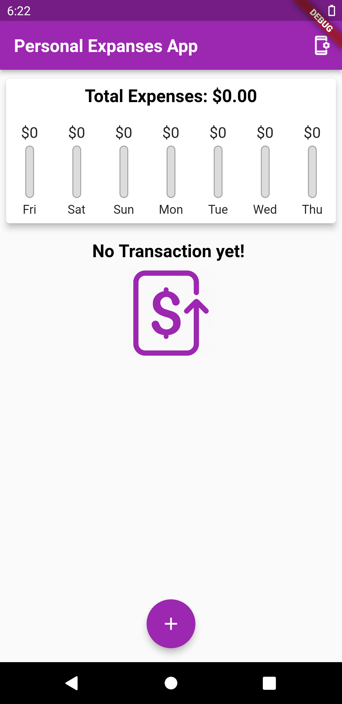

# personal_expenses_app

A small flutter application designed for learning purposes. 
It demonstrates how to develop an interactive mobile application using flutter with theming and moor database capabilities.

## Getting Started

This project is a starting point for a Flutter application.

A few resources to get you started if this is your first Flutter project:

- [Lab: Write your first Flutter app](https://flutter.dev/docs/get-started/codelab)
- [Cookbook: Useful Flutter samples](https://flutter.dev/docs/cookbook)

For help getting started with Flutter, view our
[online documentation](https://flutter.dev/docs), which offers tutorials,
samples, guidance on mobile development, and a full API reference.

## App ScreenShots
#### When there is no transaction
   

#### Adding a transaction 
    

#### the main screen with some transactions 
    
